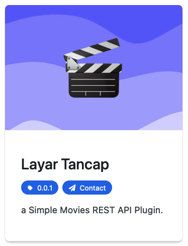

# 🎬 Layar Tancap

a Simple Movies REST API Plugin

## 📝 Installation

- Composer Update : `composer update`
- NPM Install : `npm i`
- Grunt Build : `npx grunt`
  - Refactor Dot Framework : `grunt shell:dot_refactor`

## Credits

This plugin is heavily using these free & open-source libraries
all the credits go to these peoples and communities
who had helped provide and develop these libraries

- 📟 3rd Party Libraries : [Fontawesome](https://fontawesome.com/)
- 📟 Compiler: [GruntJS](https://gruntjs.com/)
- 📟 Framework : [Dot Framework](https://github.com/artistudioxyz/dot-framework), [TailwindCSS](https://tailwindcss.com/)
- 📟 Languages : [SASS](https://sass-lang.com/), [TypeScript](https://www.typescriptlang.org/)
- 📟 Lint & Hooks : [ESLint](https://eslint.org/), [Husky](https://typicode.github.io/husky), [Prettier](https://prettier.io/)
- 📟 QA & Test : [PHP CodeSniffer](https://github.com/squizlabs/PHP_CodeSniffer), [Selenium](https://www.selenium.dev/), [WPCS](https://github.com/WordPress/WordPress-Coding-Standards)
- 📟 Release & Specification : [Conventional Commits](https://www.conventionalcommits.org/en/v1.0.0/), [Release-it](https://www.npmjs.com/package/release-it)
- 📟 Vendors : [Composer](https://getcomposer.org/), [NPM](https://www.npmjs.com/)

## Author

- [Muhammad Agung Sundoro](https://agung2001.github.io)
